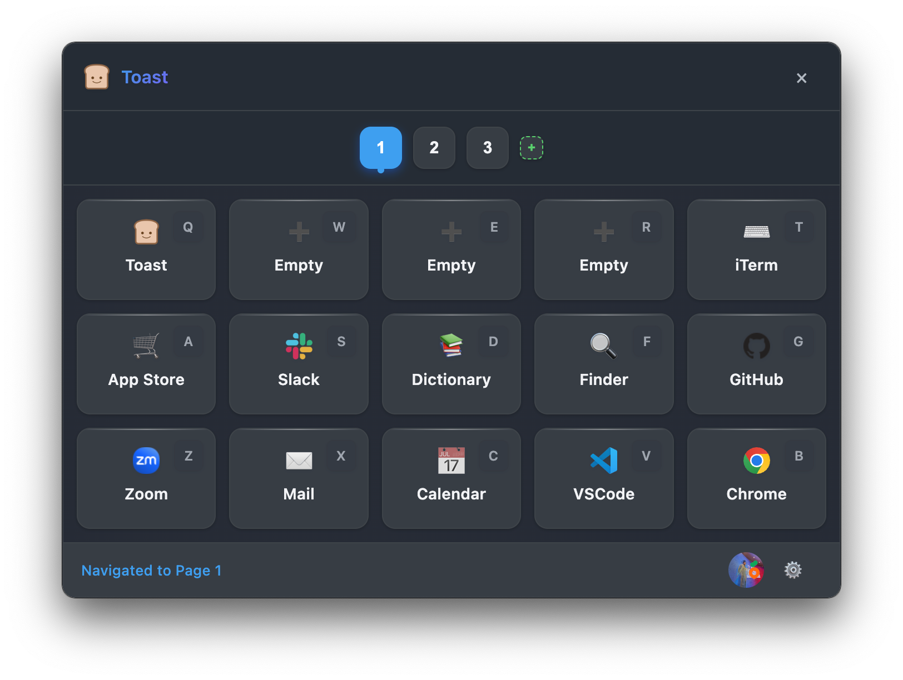

# Toast

<p align="center">
  
</p>

<p align="center">
  Official Distribution Repository for Toast App - A Customizable Shortcut Launcher for macOS and Windows
</p>

## Overview

Toast is the official distribution repository for Toast App. This repository is used to manage and distribute release versions of the built Toast App.

Toast App is a productivity tool that allows users to define custom shortcuts and actions. When triggered with a global hotkey, Toast displays a popup with user-defined buttons. Each button can be assigned a specific action or command to execute.

<p align="center">
  
</p>

## Download

You can download the latest Toast App through the following methods:

### Direct Download

Download the latest version from the [Releases page](https://github.com/opspresso/toast/releases):

- macOS: `Toast-App-mac.dmg`
- Windows: `Toast-App-win.exe`

### Homebrew (macOS)

macOS users can install via Homebrew:

```bash
brew install opspresso/tap/toast
```

To uninstall:

```bash
brew uninstall opspresso/tap/toast
```

## Key Features

- Global hotkey to trigger the Toast popup
- Multiple pages of customizable buttons:
  - Free users: 1 page
  - Authenticated users: Up to 3 pages
  - Subscribers: Up to 9 pages
- Settings Mode for quick button and page editing
- Customizable buttons with user-defined actions
- Support for keyboard shortcuts to trigger specific actions
- Multiple action types:
  - Execute commands
  - Open URLs and files
  - Trigger keyboard shortcuts
  - Run scripts (JavaScript, AppleScript, PowerShell, Bash)
  - Chain actions together in sequence
- Cross-platform support (macOS and Windows)
- Theme support (light, dark or system)
- Customizable position and size
- Minimal and non-intrusive UI
- Runs in the background with system tray integration
- Automatic updates
- Integration with Toast Web for authentication and subscription management

## Usage After Installation

1. After installation, Toast App runs in the background with an icon in the system tray/menu bar.
2. Press the global hotkey (default: `Alt+Space`) to open the Toast popup.
3. Navigate between pages using the number keys (1-9) or by clicking the page tabs.
4. Click on a button or use the corresponding shortcut key to execute an action.
5. Right-click on the system tray icon to access settings, add new buttons, or quit the application.
6. Toggle settings mode by clicking the gear icon (⚙️) or pressing the comma key (,) to edit buttons and pages.

## Updates

Toast App supports automatic updates. When a new version is released, the application will automatically display a notification and suggest an update.

To update manually:
1. Download the latest version from the [Releases page](https://github.com/opspresso/toast/releases)
2. Uninstall the existing installation (optional)
3. Install the new version

Homebrew users can update with the following command:
```bash
brew upgrade opspresso/tap/toast
```

## Troubleshooting

Solutions for common issues:

1. **Application fails to start**
   - Verify that your system meets the requirements
   - Try uninstalling previous versions and reinstalling

2. **Hotkeys not working**
   - Check for conflicts with other applications
   - Reset shortcuts in settings

3. **Cannot access subscription features**
   - Ensure you are logged into your Toast Web account
   - Check your internet connection

For more troubleshooting solutions, refer to the documentation included with the application or visit [app.toast.sh](https://app.toast.sh) for support.

## Toast Web Integration

Toast App integrates with [Toast Web](https://app.toast.sh) for user authentication and subscription management:

- User account creation and authentication
- Subscription management for premium features
- Secure access to paid features based on subscription status
- Seamless login experience via system browser

Users can create an account and manage their subscription at [https://app.toast.sh](https://app.toast.sh).

## System Requirements

- **macOS**: 10.13 (High Sierra) or later
- **Windows**: Windows 10 or later
- **Storage**: Minimum 100MB
- **Memory**: Minimum 2GB RAM

## License

MIT License - See the [LICENSE](LICENSE) file for details.

## Contact and Support

- [Official Website](https://app.toast.sh/)
